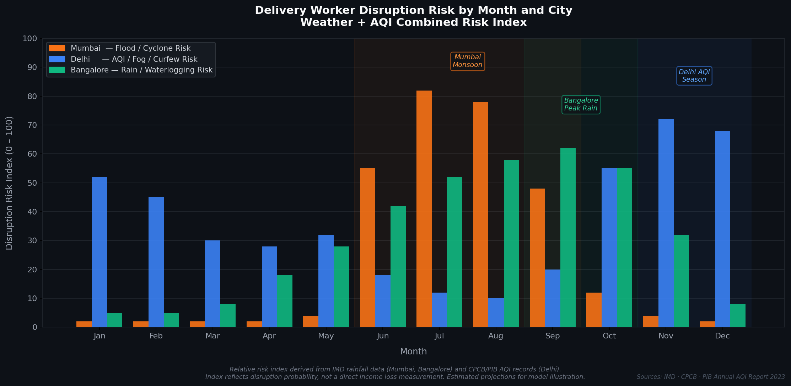
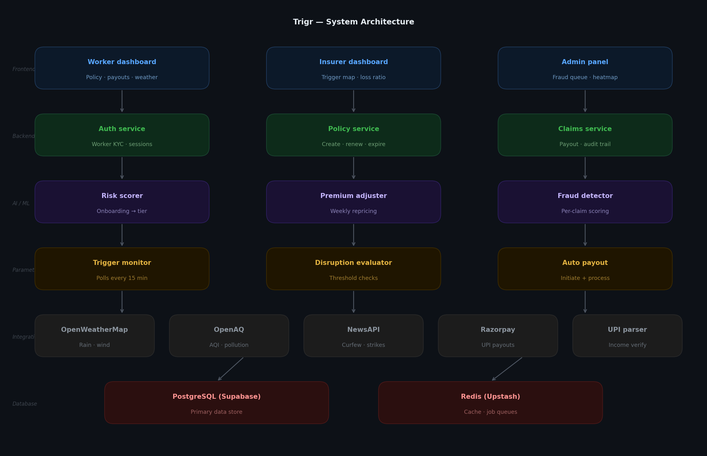
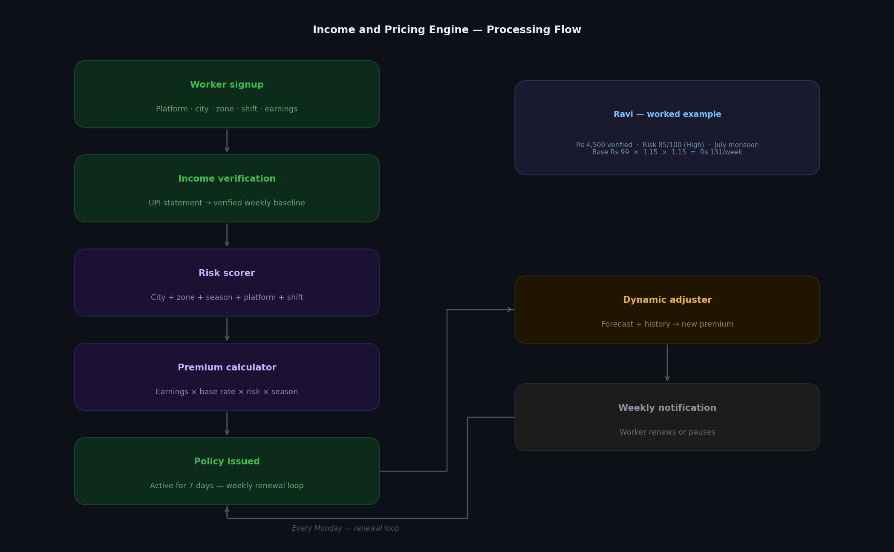
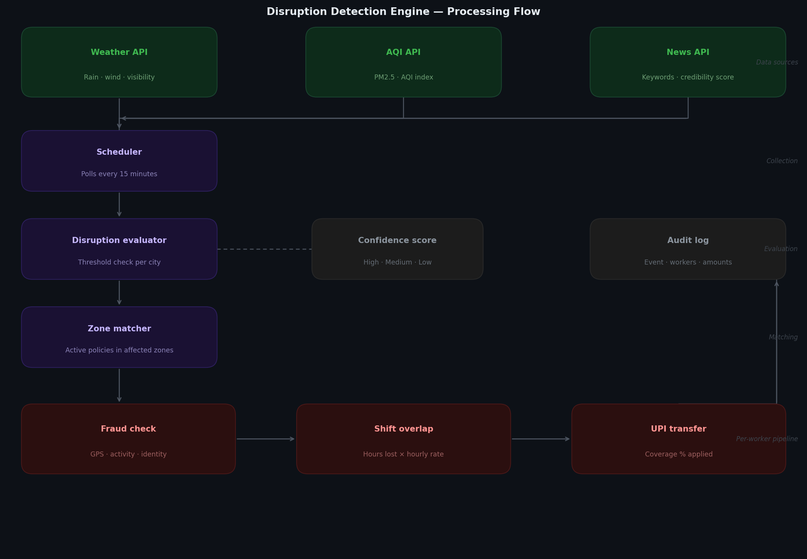
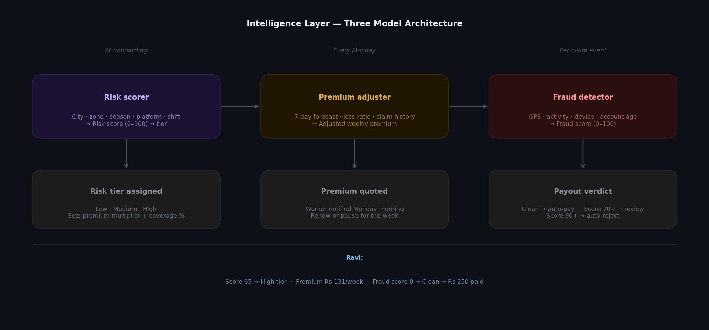

# Trigr
### AI-Enabled Parametric Income Insurance for Gig Economy Delivery Workers

> Built for Guidewire DEVTrails Hackathon

---

## The Problem

India has over 12 million platform-based delivery workers across food, grocery, and e-commerce platforms. These workers operate without any income safety net. When external disruptions hit heavy rain, severe pollution, curfews, or local strikes, they simply stop earning. No work. No pay. No protection.

The scale of this problem is significant.

```
INCOME LOSS DURING EXTERNAL DISRUPTIONS, INDIAN GIG WORKERS
(Estimated monthly average across high-disruption cities)

City            Workers Affected    Avg. Monthly Loss    Primary Cause
─────────────────────────────────────────────────────────────────────
Mumbai          ~4,20,000           Rs 1,800 – 2,400     Monsoon floods
Delhi           ~3,80,000           Rs 1,200 – 1,800     AQI / Fog / Curfew
Chennai         ~1,60,000           Rs 1,400 – 2,000     Cyclones / Rain
Kolkata         ~1,40,000           Rs 1,000 – 1,600     Floods / Strikes
Bangalore       ~2,10,000           Rs 800  – 1,200      Rain / Waterlogging
─────────────────────────────────────────────────────────────────────
Note: City-wise worker estimates are proportional projections
based on NITI Aayog's national gig workforce figure of 7.7 million (2021).

Estimated 20-30% monthly income loss during peak disruption seasons.
Source: NITI Aayog India's Booming Gig and Platform Economy, 2022 —
https://www.niti.gov.in/sites/default/files/2022-06/25th_June_Final_Report_27062022.pdf
```



Meet **Ravi**. He is a delivery partner in Dharavi, Mumbai. He earns approximately Rs 4,500 a week working 10am to 10pm, six days a week. In July 2024, three consecutive days of heavy rain meant he could not work. He lost roughly Rs 2,700 that week with no recourse, no claim to file, and no platform support. Ravi's story is not unusual, it is the norm for millions of workers every monsoon season.

**No existing product combines all of the following:** Indian delivery worker targeting, weekly pricing, AI fraud detection, social disruption triggers, and automated UPI payouts. Trigr is built to fill this gap entirely.

---

## What is Trigr

Trigr is a parametric income insurance platform for platform-based delivery workers in India. Workers pay a small weekly premium. When a verified external disruption occurs in their zone a flood, a severe AQI event, a curfew or a local strike, Trigr detects it automatically, calculates the income lost during their shift, and sends a payout directly to their UPI. No claim filing. No paperwork. No waiting.

**What Trigr covers:** Lost working hours and income caused by verified external disruptions.

**What Trigr strictly excludes:** Health, life, accidents, and vehicle repairs.

**Platform choice: Web Application.** A web app was chosen over mobile for the following reasons. It is accessible on any device without installation, easier to demonstrate to judges and stakeholders, and allows richer dashboard interfaces for all three user roles. Delivery workers in India routinely access financial services via mobile browsers no app download required.

---

## Who Trigr Serves

| Persona | Platforms | Primary Disruption Risk |
|---|---|---|
| Food Delivery Partner | Swiggy, Zomato | Heavy rain, floods, curfews |
| Grocery / Q-Commerce Partner | Blinkit, Instamart, Zepto | Severe AQI, rain, zone closures |

Ravi falls into the first category. He is the primary persona used throughout this document.

---

## System Architecture


---

## Core Modules

**Worker Onboarding and Risk Profiling** : Workers register with their platform, city, zone, shift hours, and earnings. An AI risk scorer assigns them a risk tier which feeds directly into their premium.

**Income and Pricing Engine** : Calculates a weekly premium based on verified earnings, risk tier, and current conditions. Recalculates every Monday. Detailed below.

**Disruption Detection Engine** : Polls external APIs every 15 minutes and fires automated triggers when thresholds are breached. Detailed below.

**Intelligence Layer** : Three ML models handle risk scoring, weekly repricing, and fraud detection across the full lifecycle. Detailed below.

**Payout Engine** : On a clean trigger and clean fraud check, calculates the exact income lost during the disruption window and initiates a UPI transfer automatically.

**Role-Based Dashboards** : Three separate interfaces for workers, insurers, and administrators. Detailed below.

---

## Component 1 : Income and Pricing Engine

### What This Component Does

The Income and Pricing Engine has three jobs:

1. Verify what a worker actually earns, so payouts are always tied to real income
2. Calculate a fair weekly premium based on their verified earnings and risk profile
3. Reprice every Monday based on the coming week's forecast and the worker's history

### Architecture



### Income Verification

Trigr cannot access Swiggy or Zomato's internal payment systems. Instead, workers voluntarily upload their last 4 weeks of UPI bank statements at signup. Every delivery platform pays workers via identifiable UPI credits. The system parses these credits to establish a verified weekly earnings average.

When Ravi signs up, his statement shows four weeks of Swiggy credits averaging Rs 4,500/week. His self-declaration matches. His verified baseline is set at Rs 4,500/week, giving a verified hourly rate of Rs 62.50 (Rs 4,500 divided by 72 working hours per week).

If a worker declares significantly more than their statements show, the system uses the verified figure as the basis for all payouts. This prevents earnings inflation fraud.

### Risk Scoring

A risk score from 0 to 100 is calculated at onboarding based on:

- City's historical flood and disaster frequency
- Zone type within the city (flood-prone, coastal, industrial, suburban)
- Active season at time of signup (monsoon, Delhi AQI season, normal)
- Delivery platform and its weather sensitivity
- Shift pattern (night shifts carry higher risk weighting)

Ravi scores 85 out of 100. He is in Dharavi (flood-prone zone), Mumbai (highest city risk), during July (peak monsoon). He is assigned the **High risk tier**.

### Weekly Premium Calculation

```
Base rate: 2.2% of verified weekly earnings
(Derived from a target 70% loss ratio adjusted for parametric efficiency)

Ravi's calculation:
  Base         : Rs 4,500 × 2.2%         = Rs 99
  Risk (High)  : Rs 99   × 1.15          = Rs 113.85
  Season (July): Rs 113.85 × 1.15        = Rs 130.92

  Final weekly premium: Rs 131
  Maximum weekly payout: Rs 4,500 × 80%  = Rs 3,600
```

Every Monday, the system recalculates Ravi's premium for the coming week using the 7-day weather forecast, AQI trends, any upcoming events that raise curfew risk, and his claim history. If a disruption-free week is forecast, his premium adjusts down. If three heavy rain days are predicted, it adjusts up. Ravi is notified and chooses to renew or pause.

### Variable Coverage : Why It Exists

Coverage is set at 70–80% of lost income rather than 100% for two reasons. First, partial coverage ensures workers still have a personal stake in working when conditions allow full replacement removes all incentive to continue working during marginal conditions. Second, parametric insurance triggers city-wide: when it rains heavily in Mumbai, all 847 workers in the affected zone claim simultaneously. The 20–25% self-retention is what keeps the payout pool solvent during these simultaneous events.

Ravi's High risk tier earns him 80% coverage, a higher rate than lower-risk tiers, because he pays a higher premium and faces more frequent disruptions. The extra coverage is the platform's acknowledgment of that.

### Edge Cases

**Ravi was not on shift during the disruption.** If the disruption window (say, 2am–5am) does not overlap with Ravi's shift (10am–10pm), his overlap is zero hours and his payout is Rs 0. The system only compensates for hours that would have been working hours.

**Two disruptions in one week.** Payouts accumulate against the weekly cap. If Ravi receives Rs 250 on Monday and Rs 300 on Thursday, both are paid. If a third event would push his total above Rs 3,600, the third payout is capped at the remaining balance.

**Disruption shorter than 60 minutes.** Brief rain events that resolve quickly do not qualify. A minimum 60-minute duration is required before a trigger fires, preventing micro-payouts from fleeting weather changes.

---

## Component 2 : Disruption Detection Engine

### What This Component Does

A parametric trigger is a pre-defined, objective, measurable threshold tied to an external data source. When the threshold is crossed, payouts are initiated automatically without any action from the worker. The trigger is tied to the event itself, not to the worker's experience of it. This is what makes the system fully automated and fraud-resistant at the event level.

### Trigger Categories

**Environmental triggers** are sourced from weather and pollution APIs:

- Heavy Rain: rainfall exceeding 50mm in a 3-hour window
- Extreme Rain: rainfall exceeding 100mm in a 3-hour window
- Flood Alert: active government flood warning for the zone
- Severe AQI: air quality index above 300 (Hazardous) sustained for 4+ hours
- Cyclone or Storm: wind speed above 80 km/h
- Dense Fog: visibility below 50 metres for 2+ hours

**Social and civil triggers** are sourced from news and advisory APIs:

- Curfew: confirmed via two independent news sources and government advisory
- State or City Bandh: confirmed via news sentiment analysis and keyword scoring
- Local Strike: zone-specific news combined with anomalous traffic data
- Market or Zone Closure: official government notice

Social triggers require a higher confidence threshold before firing, as a single ambiguous news article should not initiate mass payouts.

### Architecture



### Confidence Levels

Not all triggers carry the same reliability. The system assigns a confidence score to each detected event:

| Confidence | Score | Action |
|---|---|---|
| High | 90–100 | Full automatic payout |
| Medium | 70–89 | Automatic payout, flagged for audit |
| Low | 50–69 | Held for manual review |
| Insufficient | Below 50 | No trigger fired |

Weather triggers almost always score High because the data is numeric and sourced from a reliable API. Social triggers often score Medium and are audited after the fact.

### Ravi's Trigger Event

On Thursday July 17 at 2:00 PM, the scheduler polls OpenWeatherMap and receives a rainfall reading of 62.4mm for Mumbai in the last 3 hours. The threshold of 50mm is crossed. The Disruption Evaluator identifies Dharavi, Kurla, Sion, and Andheri East as affected zones based on their flood-risk classification. A query returns 847 workers with active policies in those zones, including Ravi.

For Ravi, the system calculates that his shift runs until 10pm and the disruption window is 2pm to 7pm, 5 hours of overlap. His lost income is 5 hours × Rs 62.50 = Rs 312.50. His payout at 80% coverage is Rs 250. After a clean fraud check, Rs 250 is sent to his UPI automatically. He receives a notification on his dashboard. He did not file anything.

---

## Component 3 : Intelligence Layer

### What This Component Does

Three machine learning models operate across the full platform lifecycle. Each model is rule-weighted and fully explainable, meaning every decision can be traced back to specific input signals. This is intentional: explainability is essential for insurance fairness and for auditing disputed claims.



### The Three Models

**Risk Scorer** runs once when Ravi registers. It takes his city, zone type, platform, shift pattern, and the current season as inputs and outputs a risk score and tier. This tier sets his base premium multiplier and coverage percentage. When Ravi signs up in July in Dharavi, his score of 85 places him in the High tier immediately.

**Dynamic Premium Adjuster** runs every Monday morning for all workers with active or renewing policies. It takes the 7-day weather and AQI forecast, any known upcoming events, the city-wide loss ratio for the past 4 weeks, and the individual worker's claim history. It outputs an adjusted premium for the coming week. If Mumbai's forecast shows 3 heavy rain days in the coming week, Ravi's premium increases modestly. If he has gone 8 consecutive weeks without a claim, a loyalty factor reduces his premium slightly.

**Fraud Detector** runs once per worker per disruption event. It scores each potential claim from 0 to 100. Claims scoring above 70 are flagged for manual review. Claims scoring above 90 are automatically rejected. The model checks GPS zone match against registered zone, whether the app was active before the trigger fired, whether the worker was moving (proving active delivery), account age, device fingerprint uniqueness across all accounts, and claim frequency over the past 4 weeks.

### Ravi's Fraud Check

When the rain trigger fires, Ravi's fraud check runs before any payout is processed. His GPS confirms he was in Dharavi at 1:45 PM. His app shows movement at approximately 12 km/h before the disruption. His account is 45 days old. His device is linked to only one account. He has had one prior claim this month. His fraud score is 0 out of 100. He is marked Clean. Payout proceeds automatically.

A worker who registered 2 days ago, whose GPS shows a different city, and whose device fingerprint matches 3 other accounts would score above 90 and be automatically rejected before a payout is ever initiated.

### Model Evolution Path

For the current build, all three models use rule-weighted scoring, which requires no historical training data and is immediately deployable. As the platform accumulates real claim outcomes, the models will transition to logistic regression, then to gradient boosting for premium prediction and Isolation Forest for fraud anomaly detection. The API interfaces remain identical across this evolution, the underlying model can be upgraded without changing any downstream code.

---

## Component 4 : Roles and Visibility Platform

### What This Component Does

Three role-based dashboards serve three different users. Each user sees only what is relevant to their role. Authentication is handled at both the application routing layer and the database policy layer, ensuring strict separation.

```
WORKER DASHBOARD     -  Ravi and other delivery partners
INSURER DASHBOARD    -  Operations team monitoring platform health
ADMIN PANEL          -  Internal team reviewing flagged claims
```

### Worker Dashboard

This is what Ravi sees when he opens Trigr. The interface is designed for mobile browser use and answers three questions at a glance: Is my coverage active this week? Did I receive any payout? What are current conditions in my zone?

The dashboard shows his active policy window and premium paid, a live weather and AQI widget for his registered zone, a disruption banner if an event is currently active, the status and amount of his most recent payout, and a one-tap renewal option with the coming week's estimated premium shown upfront.

When Ravi opens his app at 7 PM on July 17, he sees a banner: *Heavy Rain - Dharavi - 2pm to 7pm. Payout of Rs 250 sent to your UPI.* Below it, his claim history shows the net benefit across the month: total premiums paid vs total payouts received.

### Insurer Dashboard

The operations team sees the platform from a macro level. The primary view is a live map of India showing active disruption zones, the number of workers affected per zone, and the total payout volume currently being processed.

A financial health panel shows the current week's premium pool, total payouts, and the running loss ratio. A loss ratio consistently below 80% indicates a financially healthy pool. The disruption event log shows every trigger event with its source data, duration, affected worker count, and total payout.

When the Mumbai rain event fires, the insurer dashboard updates in real time: *Mumbai - Heavy Rain - 847 workers - Rs 2,12,000 processing.*

### Admin Panel

The admin team sees only flagged claims, the fraud review queue. Each flagged claim shows the specific signals that fired, the raw evidence (GPS coordinates, app activity timestamps, account age), the fraud score, and the recommended verdict. A reviewer can approve, reject, or suspend the account directly from this view.

The panel also surfaces fraud analytics: total claims processed, auto-approval rate, confirmed fraud cases, and estimated losses prevented by the fraud detection layer.

---

## Tech Stack

| Layer | Technology |
|---|---|
| Frontend | Next.js 14 + TailwindCSS + shadcn/ui |
| Backend | FastAPI (Python) |
| Primary Database | Supabase (PostgreSQL) |
| Cache and Queues | Upstash Redis |
| AI / ML | scikit-learn + pandas |
| Background Scheduler | APScheduler |
| Payments | Razorpay Test Mode |
| Weather Data | OpenWeatherMap API |
| AQI Data | OpenAQ API |
| News and Social | NewsAPI |
| Deployment | Vercel (frontend) + Railway|


---

## Why Trigr Has a Future

India's gig workforce is projected to reach 23.5 million workers by 2030 (NITI Aayog, 2022). Climate volatility is increasing the frequency and severity of weather disruptions across Indian cities every year. At the same time, UPI has made instant micro-payments to any worker in any city a solved infrastructure problem.

The conditions that make Trigr viable, a large unprotected workforce, worsening external disruptions, and instant payment rails are all strengthening simultaneously.

Ravi does not need a bank relationship, a broker, or a smartphone app. He needs a browser, a UPI ID, and Rs 131 a week. When the next flood hits Dharavi, he gets paid automatically while his competitors on unprotected platforms absorb the loss entirely.

Parametric insurance removes the friction that has historically kept insurance away from informal and gig workers. Trigr is built on the premise that the workers who need protection the most are precisely those who have the least time to file for it.

---
